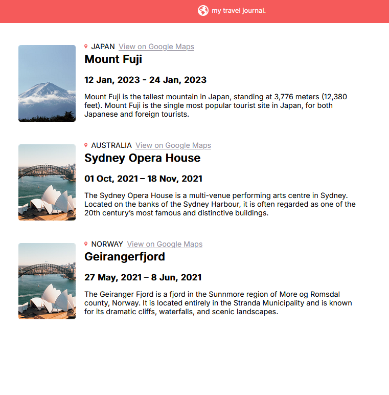

# Project Travel Journal

<!-- PROJECT SHIELDS -->
[![Contributors][contributors-shield]][contributors-url]
[![Forks][forks-shield]][forks-url]
[![Stargazers][stars-shield]][stars-url]
[![Issues][issues-shield]][issues-url]
[![Demo][demo-shield]][demo-url]
[![LinkedIn][linkedin-shield]][linkedin-url]

<!-- PROJECT LOGO -->
<br />
<div align="center">
  <a href="https://github.com/codingmaniac227/Project-Travel-Journal">
    
  </a>

  <h3 align="center">Project Travel Journal</h3>

  <p align="center">
    A clean, responsive travel journal built with React + Vite.
    <br />
    <a href="https://github.com/codingmaniac227/Project-Travel-Journal"><strong>Explore the repo »</strong></a>
    <br />
    <br />
    <a href="https://travel-journal-demo.netlify.app">View Demo</a>
    ·
    <a href="https://github.com/codingmaniac227/Project-Travel-Journal/issues">Report Bug</a>
    ·
    <a href="https://github.com/codingmaniac227/Project-Travel-Journal/issues">Request Feature</a>
  </p>
</div>

<p align="center">
  <a href="https://react.dev/"></a>
  <a href="https://vitejs.dev/"></a>
</p>

---

## Table of Contents
<details>
  <summary>Expand</summary>
  <ol>
    <li><a href="#about-the-project">About The Project</a></li>
    <li><a href="#screenshot">Screenshot</a></li>
    <li><a href="#features">Features</a></li>
    <li><a href="#tech-stack">Tech Stack</a></li>
    <li><a href="#project-structure">Project Structure</a></li>
    <li><a href="#live-demo">Live Demo</a></li>
    <li><a href="#getting-started">Getting Started</a></li>
    <li><a href="#usage">Usage</a></li>
    <li><a href="#responsive-behavior">Responsive Behavior</a></li>
    <li><a href="#whats-next-moving-to-data-driven-react">What’s Next</a></li>
    <li><a href="#roadmap">Roadmap</a></li>
    <li><a href="#accessibility-notes">Accessibility Notes</a></li>
    <li><a href="#scripts">Scripts</a></li>
    <li><a href="#contributing">Contributing</a></li>
    <li><a href="#contact">Contact</a></li>
    <li><a href="#acknowledgments">Acknowledgments</a></li>
    <li><a href="#license">License</a></li>
  </ol>
</details>

---

## About The Project

This is a small, clean travel journal app built as a prelude to a data‑driven React refactor. The goal was to perfect the markup, layout, and accessibility first, then evolve it into a reusable component that renders from data.

<p align="right">(<a href="#project-travel-journal">back to top</a>)</p>

---

## Screenshot

<p align="center">
  
</p>

<p align="right">(<a href="#project-travel-journal">back to top</a>)</p>

---

## Features

- Three journal entries (Japan – Mount Fuji, Australia – Sydney Opera House, Norway – Geirangerfjord)
- Semantic, accessible markup (headings, links, and readable date formatting)
- Responsive layout with clean breakpoints for tablet/phone
- Image optimization via Vite asset handling
- Simple, minimal CSS with a focus on readability

<p align="right">(<a href="#project-travel-journal">back to top</a>)</p>

---

## Tech Stack

- **Frontend:** React 19 + Vite
- **Styling:** Plain CSS (mobile-friendly media queries)
- **Tooling:** ESLint (optional)

<p align="right">(<a href="#project-travel-journal">back to top</a>)</p>

---

## Project Structure

```
project-root/
├─ public/
│  └─ (static files if needed)
├─ src/
│  ├─ assets/
│  │  ├─ japan-img.png
│  │  ├─ australia-img.png
│  │  ├─ norway-img.png
│  │  ├─ location-icon.svg
│  │  ├─ logo.png
│  │  └─ screenshot.png
│  ├─ components/
│  │  ├─ Header.jsx
│  │  └─ Entry.jsx          ← renders the three cards
│  ├─ App.jsx
│  ├─ App.css               ← core styles & media queries
│  ├─ index.css
│  └─ main.jsx
├─ package.json
└─ README.md
```

> **Note on assets:** images are imported from `src/assets` so that Vite can fingerprint/optimize them at build time.

**Example import:**

```jsx
import japanImg from '../assets/japan-img.png'

```

<p align="right">(<a href="#project-travel-journal">back to top</a>)</p>

---

## Live Demo

- **Netlify:** https://travel-journal-demo.netlify.app

<p align="right">(<a href="#project-travel-journal">back to top</a>)</p>

---

## Getting Started

### Prerequisites
- Node.js 18+ (recommended)

### Install & Run
```bash
# install
npm install

# start dev server
npm run dev

# build for production
npm run build

# preview production build locally
npm run preview
```

<p align="right">(<a href="#project-travel-journal">back to top</a>)</p>

---

## Usage

- Add or edit entries directly in `Entry.jsx` (static version).  
- Assets are imported from `src/assets` so they are fingerprinted by Vite.  
- To keep paths working on Netlify, import images (recommended) or place them in `/public` and reference with root paths (`/images/...`).

> **Next step:** convert to a data‑driven `<EntryCard />` and render an array of entries. See **What’s Next** below.

<p align="right">(<a href="#project-travel-journal">back to top</a>)</p>

---

## Responsive Behavior

- **Desktop:** two-column card (image + content), capped text width for readability.
- **≤ 768px (tablet):** cards stack vertically; images shrink.
- **≤ 480px (phone):** tighter padding & font sizes, smaller images.

Media queries live in `App.css`.

<p align="right">(<a href="#project-travel-journal">back to top</a>)</p>

---

## What’s Next: Moving to Data‑Driven React

This project was intentionally completed **right before** a data‑driven refactor. Building the static version first helps you:

- **Lock in markup & styles** before adding abstractions.
- **Identify reusable patterns** (card layout, header row, dates, link styles).
- **Reduce complexity** when you introduce a reusable `<EntryCard />` and render from an array.

**Why it matters:** after the refactor, adding 300 entries becomes a data task, not a markup task.

**Sketch of the next step:**
```jsx
// entries.js
export const entries = [
  { country: 'JAPAN', title: 'Mount Fuji', start: '2023-01-12', end: '2023-01-24', ... },
  // ...
]

// Entry.jsx
{entries.map(e => <EntryCard key={e.title} {...e} />)}
```

<p align="right">(<a href="#project-travel-journal">back to top</a>)</p>

---

## Roadmap

- [x] Static journal entries and layout  
- [x] Responsive breakpoints for tablet/phone  
- [x] Netlify deployment  
- [ ] Extract `<EntryCard />` component  
- [ ] Render entries from a data array  
- [ ] Add theme switch (dark/light)  
- [ ] Add tests for layout regressions

<p align="right">(<a href="#project-travel-journal">back to top</a>)</p>

---

## Accessibility Notes

- Meaningful `alt` text for photos; decorative icons use `alt=""`.
- Proper heading order (`h1` in the header, `h2` per entry).
- Links are descriptive (“View on Google Maps”).

<p align="right">(<a href="#project-travel-journal">back to top</a>)</p>

---

## Scripts

```json
{
  "dev": "vite",
  "build": "vite build",
  "preview": "vite preview",
  "lint": "eslint ."
}
```

<p align="right">(<a href="#project-travel-journal">back to top</a>)</p>

---

## Contributing

Open issues and PRs are welcome!  
https://github.com/codingmaniac227/Project-Travel-Journal/issues

<p align="right">(<a href="#project-travel-journal">back to top</a>)</p>

---

## Contact

Marquise Davis – <a href="https://instagram.com/FullStackDemon" target="_blank" rel="noopener">@FullStackDemon</a>  
codingmaniac227@gmail.com  
Project Link: <a href="https://github.com/codingmaniac227/Project-Travel-Journal" target="_blank" rel="noopener">https://github.com/codingmaniac227/Project-Travel-Journal</a>

<p align="right">(<a href="#project-travel-journal">back to top</a>)</p>

---

## Acknowledgments

- React + Vite community
- Netlify for quick deploys
- Everyone who shares CSS layout tips and accessibility guidance

<p align="right">(<a href="#project-travel-journal">back to top</a>)</p>

---

## License

MIT — feel free to reuse with attribution.

<p align="right">(<a href="#project-travel-journal">back to top</a>)</p>

<!-- MARKDOWN LINKS & IMAGES -->
[contributors-shield]: https://img.shields.io/github/contributors/codingmaniac227/Project-Travel-Journal?style=for-the-badge
[contributors-url]: https://github.com/codingmaniac227/Project-Travel-Journal/graphs/contributors
[forks-shield]: https://img.shields.io/github/forks/codingmaniac227/Project-Travel-Journal?style=for-the-badge
[forks-url]: https://github.com/codingmaniac227/Project-Travel-Journal/network/members
[stars-shield]: https://img.shields.io/github/stars/codingmaniac227/Project-Travel-Journal?style=for-the-badge
[stars-url]: https://github.com/codingmaniac227/Project-Travel-Journal/stargazers
[issues-shield]: https://img.shields.io/github/issues/codingmaniac227/Project-Travel-Journal?style=for-the-badge
[issues-url]: https://github.com/codingmaniac227/Project-Travel-Journal/issues
[demo-shield]: https://img.shields.io/website?url=https%3A%2F%2Ftravel-journal-demo.netlify.app&label=demo&up_color=brightgreen&up_message=online&down_message=offline&style=for-the-badge
[demo-url]: https://travel-journal-demo.netlify.app
[linkedin-shield]: https://img.shields.io/badge/-LinkedIn-black.svg?style=for-the-badge&logo=linkedin&colorB=555
[linkedin-url]: https://www.linkedin.com/in/marquise-davis/
